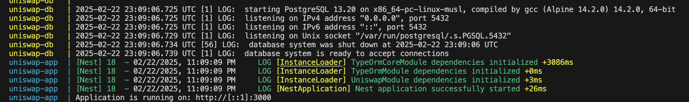

# Uniswap Sync

## Overview
Uniswap Sync is a NestJS backend application that periodically fetches data from the UniswapV3 subgraph and stores it in a PostgreSQL database. The application synchronizes UniswapV3 pool and tick data, enabling accurate pricing calculations.

## Requirements
- Node.js
- PostgreSQL

## Setup Instructions

### Step 1: Clone the Repository
Clone the repository to your local machine:
```sh
git clone https://github.com/karosi12/uniswap-sync.git
cd uniswap-sync
```

### Step 2: Install Dependencies
```sh
npm install
```
### Step 3: Configure Environment Variables
```sh
DATABASE_HOST=localhost
DATABASE_PORT=5432
DATABASE_USER=your_username
DATABASE_PASSWORD=your_password
DATABASE_NAME=uniswap
PORT=3000
UNISWAP_URL=https://gateway.thegraph.com/api/{api-key}/subgraphs/id/5zvR82QoaXYFyDEKLZ9t6v9adgnptxYpKpSbxtgVENFV
```
### Step 4: Set Up PostgreSQL Database using docker
```sh
docker run --name uniswap -e POSTGRES_USER=your_username -e POSTGRES_PASSWORD=your_password -e POSTGRES_DB=uniswap -p 5432:5432
-d --network uniswap postgres

```
### Step 5: Run the Application
```sh
npm run start
```
### Run unit test
```sh
npm run test
```
### To format the code
```sh
npm run format
```
### Step 6(optional): Run the Application using docker-compose
```sh
docker-compose up --build 
# To run docker compose in detach mode
docker-compose up --build -d 
```
